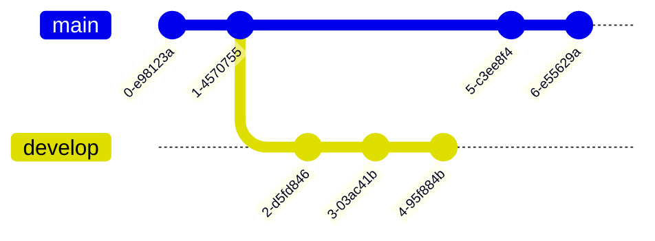
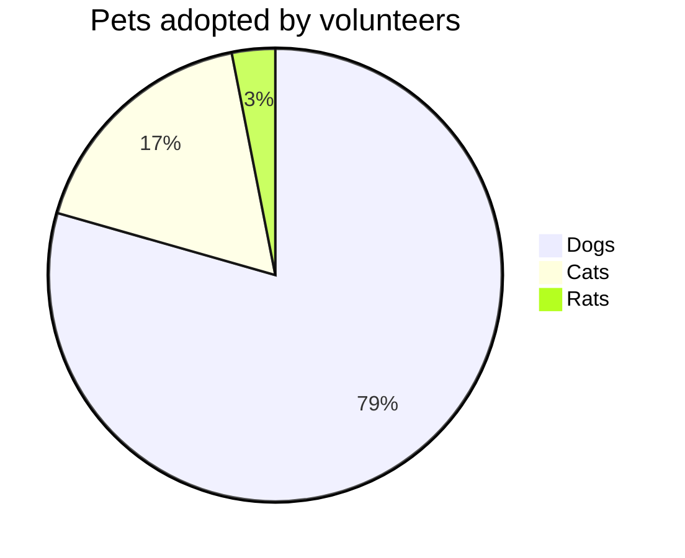

# Cabecera

Cabecera
=

## Subcabecera

Subcabecera 
-

## Estilos

*Enfasis* _Enfasis_
**Negrita** __Negrita__
***Negrita y enfasis***
~~tachado~~
==resaltado==
^^superscript^^
`Codigo`

## Listas:

### Ordenadas

1. item 1
1. item 1
1. item 1

1) item1
1) item1
1) item1

## No ordenadas

- item 1
- item 1

  + item 1
  + item 1

    * item 1
    * item 1
    
## Tablas

| columna 1 | Coluimna 2 |
| --------- | ---------: |
| columna 1 | Coluimna 2 |
| columna 1 | Coluimna 2 |

## Enlaces:

[Ir a google](http://www.google.es)


## Bloques de código

```mustache
    kind:           Secret
    apiVersion:     v1
    metadata:
        name:       {{ include "secret.name" . }}
    
    data:
        contrasena-root:        {{ (default (randAscii 15) .Values.mariadb.config.rootPassword) | trim | b64enc | quote }}
        contrasena-usuario:     {{ if .Values.mariadb.config.password }}
                                    {{- .Values.mariadb.config.password | trim | b64enc | quote -}}
                                {{ else -}}
                                    {{ randAscii 15 | trim | b64enc | quote }}
                                {{- end }}
        usuario:                {{ (default "dbuser" .Values.mariadb.config.user) | trim | b64enc | quote }}
```

## Mermaid






